# What we take from each upstream

Bold `sf-*` skills are in the first build round. The rest come later.

```mermaid
flowchart LR
  subgraph MP["mattpocock/skills"]
    mp_wfa[writing-for-agents]
    mp_grill[grilling + grill-me]
    mp_dom[domain-modeling]
    mp_tri[triage + AGENT-BRIEF + OUT-OF-SCOPE]
    mp_setup[setup-matt-pocock-skills]
    mp_tdd[tdd]
    mp_impl[implement / implement-spec]
    mp_cr[code-review: spec axis]
    mp_pr[pr]
    mp_spec[grill-with-docs, to-spec]
    mp_tick[to-tickets, wayfinder, codebase-design]
    mp_diag[diagnosing-bugs]
    mp_retro[retro]
  end

  subgraph PS["cursor pstack + cursor plugins"]
    ps_mode[poteto-mode: playbooks, autonomy rules]
    ps_night[guide: overnight contract]
    ps_nc[no-comments + comment-sicko]
    ps_cvs[create-verification-skill]
    ps_mvs[maintain-verification-skill]
    ps_prove[principle-prove-it-works, benchmark-checklist]
    ps_int[interrogate: multi-model panel]
    ps_pr[opening-a-pr, babysit, bugbot-triage, shipping]
    ps_refl[reflect, automate-me, correct]
    ps_prin[principles: laziness, root causes, attack the premise, test behavior, encode lessons in structure]
    ps_swarm[swarm]
    ps_unslop[unslop]
    cu_cli[cli-for-agents, control-cli]
    cu_cl[continual-learning, workflow-from-chats]
  end

  subgraph AO["addyosmani/agent-skills"]
    ao_cr[code-review-and-quality: five axes]
    ao_pers[personas: code-reviewer, security-auditor, test-engineer]
    ao_doubt[doubt-driven-development]
    ao_inc[incremental-implementation]
    ao_ship[shipping-and-launch: GO/NO-GO, rollback]
    ao_def[interview-me, idea-refine, spec-driven]
    ao_con[constraint-driven-development]
    ao_src[source-driven-development]
    ao_eval[evals: structure, routing, behaviour]
  end

  subgraph SF["software-factory"]
    direction TB
    sf_setup["**sf-setup**"]
    sf_wfa["**sf-writing-for-agents**"]
    sf_grill["**sf-grilling**"]
    sf_dom["**sf-domain-modeling**"]
    sf_tri["**sf-triage**"]
    sf_build["**sf-build**"]
    sf_tdd["**sf-tdd**"]
    sf_ver["**sf-verify**"]
    sf_sv["**sf-setup-verify**"]
    sf_rev["**sf-review**"]
    sf_nc["**sf-no-comments**"]
    sf_ship["**sf-ship**"]
    sf_wfh["**sf-writing-for-humans**"]
    sf_swarm["**sf-swarm**"]
    sf_prin["**sf-principle-* x24**"]
    sf_def[sf-define]
    sf_plan[sf-plan]
    sf_ts[sf-troubleshoot]
    sf_auto[sf-auto]
    sf_imp[sf-improve]
    sf_mnt[sf-maintain + sf-maintain-verify]
  end

  mp_wfa --> sf_wfa
  mp_grill --> sf_grill
  mp_dom --> sf_dom
  mp_tri --> sf_tri
  mp_setup --> sf_setup
  ao_con -.later.-> sf_setup
  mp_tdd --> sf_tdd
  mp_impl --> sf_build
  ao_inc --> sf_build
  ao_src --> sf_build
  ps_prove --> sf_ver
  ps_cvs --> sf_sv
  cu_cli --> sf_sv
  ao_cr --> sf_rev
  ao_pers --> sf_rev
  mp_cr --> sf_rev
  ps_int --> sf_rev
  ao_doubt --> sf_rev
  ps_nc --> sf_nc
  ps_pr --> sf_ship
  mp_pr --> sf_ship
  ao_ship --> sf_ship
  mp_spec --> sf_def
  ao_def --> sf_def
  mp_tick --> sf_plan
  mp_diag --> sf_ts
  ps_mode --> sf_auto
  ps_night --> sf_auto
  ps_prin --> sf_prin
  ps_swarm --> sf_swarm
  ps_unslop --> sf_wfh
  mp_retro --> sf_imp
  ps_refl --> sf_imp
  cu_cl --> sf_imp
  ps_mvs --> sf_mnt
  ao_eval --> sf_mnt
```

## By skill

| sf skill | Phase | Taken from | What we change |
|---|---|---|---|
| **sf-setup** | setup | Matt `setup-matt-pocock-skills` | Adds `stack.md` (build/test/lint commands, test seams: host, simulator, HIL) and `verify.md`. Drops pnpm/TS detection |
| **sf-writing-for-agents** | meta | Matt `writing-for-agents` | Nearly verbatim |
| **sf-grilling** | define (leaf) | Matt `grilling` + `grill-me` | Merged into one |
| **sf-domain-modeling** | define (leaf) | Matt `domain-modeling` | `GLOSSARY.md` + ADRs, as upstream |
| **sf-triage** | outer loop | Matt `triage`, `AGENT-BRIEF.md`, `OUT-OF-SCOPE.md` | New states `needs-define` and `needs-repro`, routing to the next phase, self-applies its decision under `gates: auto` |
| **sf-build** | build | Matt `implement`; addy `incremental-implementation`, `source-driven-development` | Runs in a worktree, reads `brief.md`, writes `build.md` |
| **sf-tdd** | build (leaf) | Matt `tdd` | pytest examples, firmware test seams (host vs on-target) |
| **sf-verify** | verify | pstack `prove-it-works`, `benchmark-checklist` | Drives the project's verify skill and control CLI, writes `evidence.md` |
| **sf-setup-verify** | setup | pstack `create-verification-skill`; Cursor `cli-for-agents`, `control-cli` | Generates the verify skill and a control CLI. Firmware drive recipes: flash, serial, reset, capture, HIL |
| **sf-review** | review | addy five axes + personas, `doubt-driven-development`; Matt `code-review` spec axis; pstack `interrogate` | One reference file per reviewer, run in parallel through `sf ask`, with firmware variants for security and performance |
| **sf-no-comments** | review (leaf) | pstack `no-comments` + `comment-sicko` | Python/C suppressions; register and errata notes count as the vendor exception |
| **sf-ship** | ship | pstack `opening-a-pr`, `babysit`, `bugbot-triage`; Matt `pr`; addy `shipping-and-launch` | PR body, triage of review comments, GO/NO-GO with a rollback plan. Rollout thinking adapted for OTA/flash. Never merges without a human |
| **sf-writing-for-humans** | define (leaf) | pstack `unslop`, `technical-writing` | Renamed. Python examples |
| **sf-swarm** | shared leaf | pstack `swarm` | Harness-neutral fan-out: subagents, or `sf ask` per worker. Used by sf-review and sf-verify |
| **sf-principle-\*** (24) | shared leaf | pstack `principle-*` | One skill each, user-invoked, referenced by path. Python/firmware examples |
| sf-define | define | Matt `grill-with-docs`, `to-spec`; addy `interview-me`, `idea-refine`, `spec-driven-development` | Writes `brief.md` or `SPEC.md` |
| sf-plan | plan | Matt `to-tickets`, `wayfinder`, `codebase-design` | |
| sf-troubleshoot | outer loop | Matt `diagnosing-bugs` | Firmware feedback loops: serial, JTAG, HIL, logic analyzer |
| sf-auto | all | pstack `poteto-mode`, overnight contract, selected principles | Chains the phases, gate policy, `sf run` runner |
| sf-improve | meta | Matt `retro`; pstack `reflect`, `automate-me`, `correct`; Cursor `continual-learning`, `workflow-from-chats` | Per-session review plus weekly transcript mining, ending in a PR |
| sf-maintain, sf-maintain-verify | meta | pstack `maintain-verification-skill`; addy evals | Upstream diffs, evals, verify-skill re-check |

## Left out

| Source | Skipped | Why |
|---|---|---|
| pstack | `setup-pstack` model slugs, Cursor automations, `typescript-best-practices`, visual-parity, iOS/Electron forensics, arena (for now) | Cursor-only or web/TS-only. Model choice moves to `sf` config |
| addy | browser-testing, frontend-ui, web-performance-auditor, Core Web Vitals perf, CI/CD (GitHub Actions specifics), observability (OTel) | Web/SaaS-specific |
| Matt | `misc/` (shoehorn, Husky pre-commit, git-guardrails), `in-progress/`, `teach`, `ask-matt` (replaced by `sf-auto`) | TS-only or out of scope |
