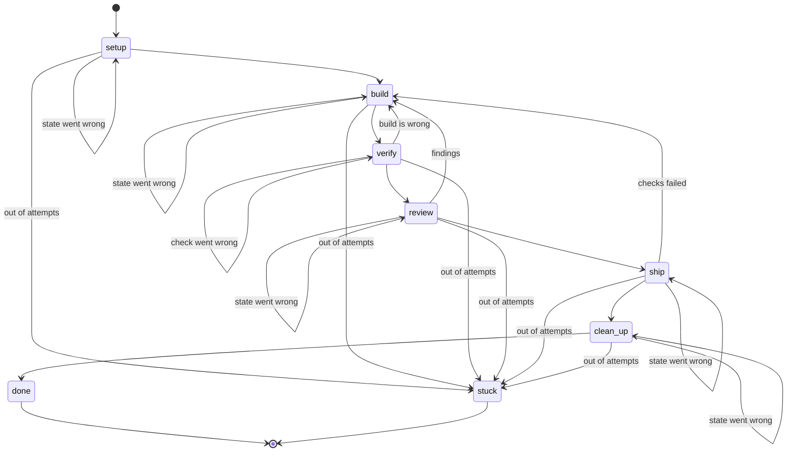

# States

How a unit moves through `ns run`. The table in `cli/src/state.rs` is the source of truth.

```mermaid
stateDiagram
    [*] --> setup
    setup --> build
    build --> verify
    verify --> review
    review --> ship
    ship --> clean_up
    clean_up --> done
    done --> [*]

    verify --> build : build is wrong
    review --> build : findings
    ship --> build : checks failed
    setup --> setup : state went wrong
    build --> build : state went wrong
    verify --> verify : check went wrong
    review --> review : state went wrong
    ship --> ship : state went wrong
    clean_up --> clean_up : state went wrong

    setup --> stuck : out of attempts
    build --> stuck : out of attempts
    verify --> stuck : out of attempts
    review --> stuck : out of attempts
    ship --> stuck : out of attempts
    clean_up --> stuck : out of attempts
    stuck --> [*]
```
